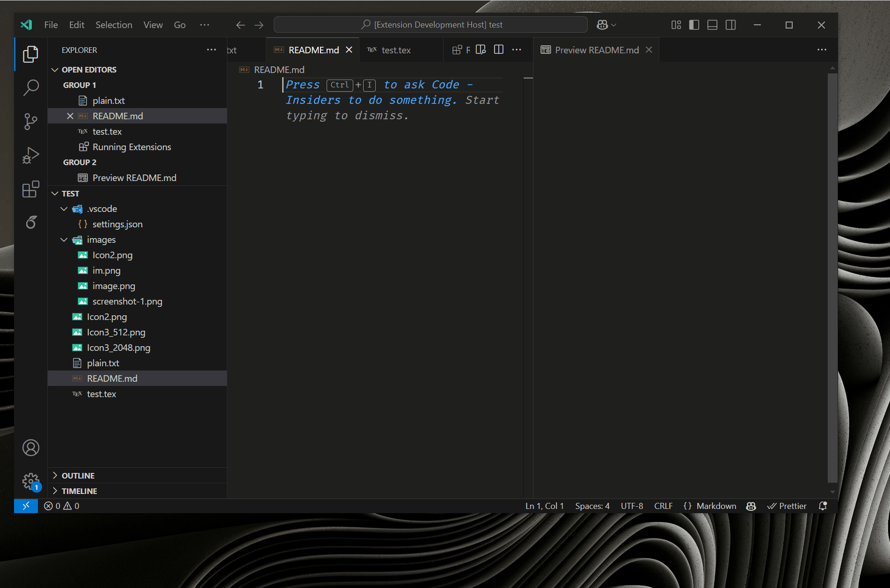
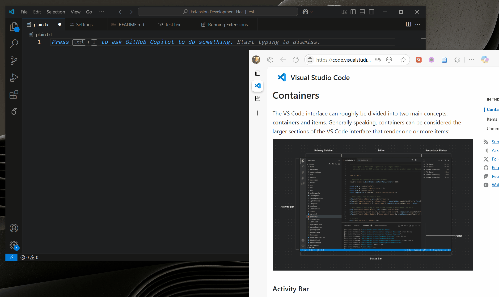
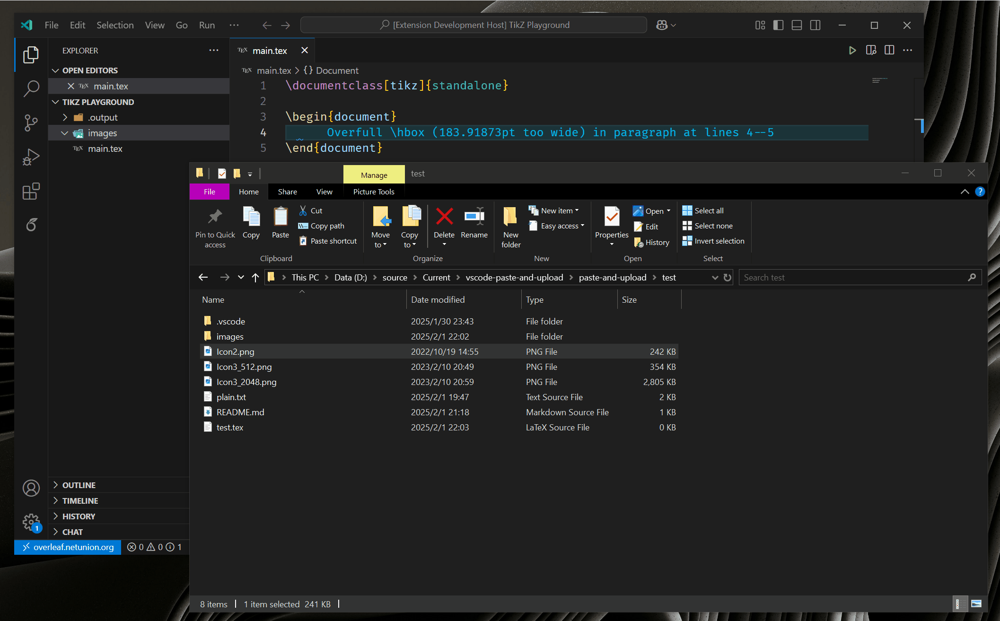
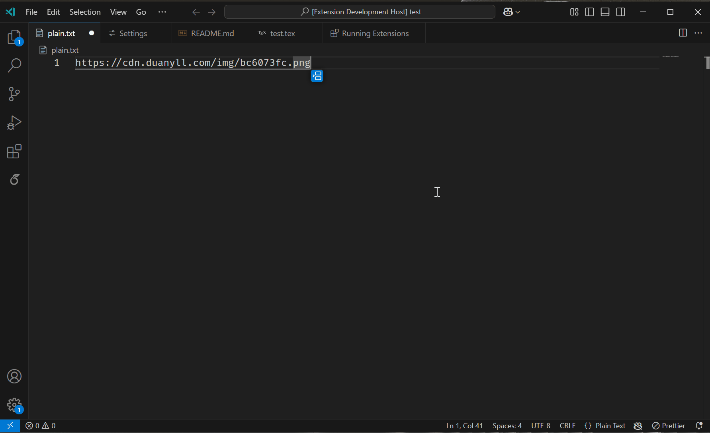

# Paste and Upload

This extension allows you to paste images (and other files) directly from your clipboard, upload them to a S3 bucket or save them to your workspace, then insert a link pointing to the image. It utilizes the `DocumentPaste` and `DocumentDrop` API and works on remote workspaces.

## Features

- Fetch images from clipboard with VS Code API, even in remote workspaces. No extra hotkeys required, simply press `Ctrl+V` to paste images!
  
- Or drag and drop images from your file explorer or browser
  
- Language overridable snippets for inserting links (Built-in support for Markdown and LaTeX)
- Upload images to any S3-compatible storage (Not limited to AWS S3, e.g. Aliyun OSS, Cloudflare R2, etc.)
- Or save images to your workspace (Supports virtual workspaces like [Overleaf Workshop](https://marketplace.visualstudio.com/items?itemName=iamhyc.overleaf-workshop))
  

## Requirements

Need VS Code 1.97 or later. No external dependencies are required, works across all platforms and remote workspaces.

## Extension Settings

Refer to `Settings` -> `Extensions` -> `Paste and Upload` for full list of settings. Heres somthing you might want to configure in `settings.json`:

```jsonc
{
  "paste-and-upload.s3.region": "oss-cn-hongkong",
  // If you are not using AWS S3, you need to set the endpoint
  "paste-and-upload.s3.endpoint": "https://oss-cn-hongkong.aliyuncs.com",
  "paste-and-upload.s3.accessKeyId": "YourAccessKeyId",
  "paste-and-upload.s3.secretAccessKey": "YourSecretAccessKey",
  "paste-and-upload.s3.bucket": "your-bucket-name",
  // Will be prepended to S3 object key (Slashes will be preserved as is)
  "paste-and-upload.s3.prefix": "img/",
  // Will be prepended to inserted link (Slashes will be preserved as is)
  "paste-and-upload.s3.publicUrlBase": "https://cdn.duanyll.com/img/"
}
```

It is recommended to configure S3 credentials in your user settings to avoid leaking them. After configuring S3 related options, you can press `Ctrl+Shift+P` and search for `Paste and Upload: Test S3 Connection` to verify your settings.

All settings are overridable by workspace settings. Settings directly belonging to `paste-and-upload` section can be overriden by language-specific settings. For example, the following configuration will enable paste-and-upload for Markdown and LaTeX, and upload images to S3 for Markdown and save images to workspace for LaTeX:

```jsonc
{
  "paste-and-upload.enabled": false,
  // Save as ${workspaceFolder}/figures/image.png
  "paste-and-upload.workspace.path": "figures",
  // Insert \includegraphics{image.png} (If you have \graphicspath{figures})
  "paste-and-upload.workspace.linkBase": "",    
  "[markdown]": {
    "paste-and-upload.enabled": true,
    "paste-and-upload.uploadDestination": "s3"
  },
  "[latex]": {
    "paste-and-upload.enabled": true,
    "paste-and-upload.uploadDestination": "workspace"
  }
}
```

You may also want to configure `paste-and-upload.fileNamingMethod` to customize the naming of uploaded files. 

## Known Issues

Undoing paste operation by pressing `Ctrl+Z` can revert changes in the workspace, but the images are not deleted from S3. This is a limitation of VS Code API. We provide a workaround by adding a `Paste and Upload: Undo Recent Upload` command, which will show a list of recent uploads and allow you to manually select and delete them.



## Release Notes

### 0.1.0

Initial release of Paste and Upload.

## Acknowledgements

The icon comes from [PureSugar Icons](https://dribbble.com/shots/6689165-Pure-Sugar-60-Free-SVG-Icons-Pack-Sketch-Vector-Icon-Freebie) by Nitish Khagwal.